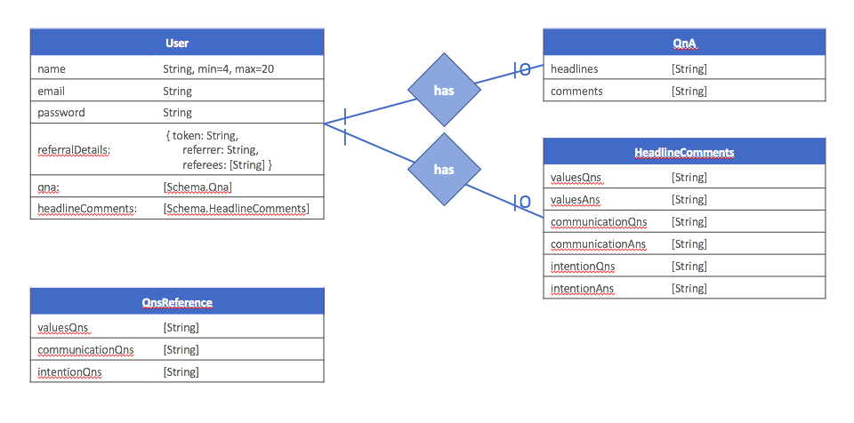
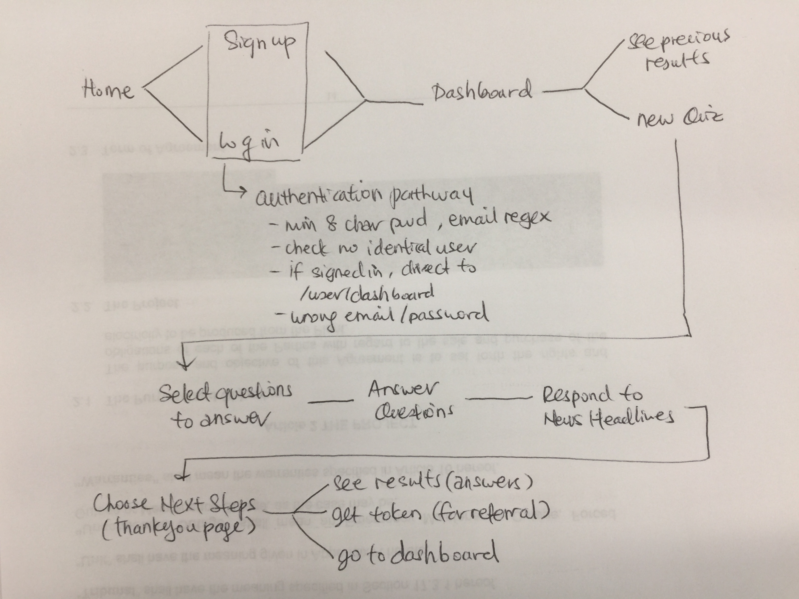
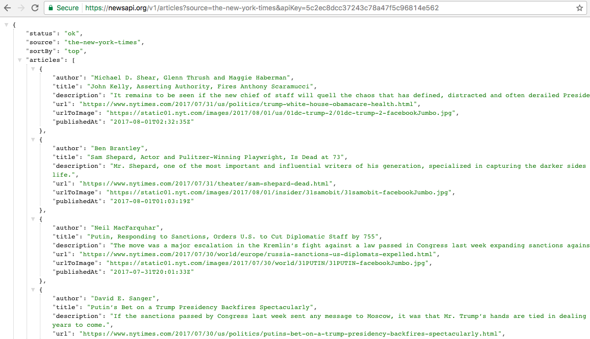
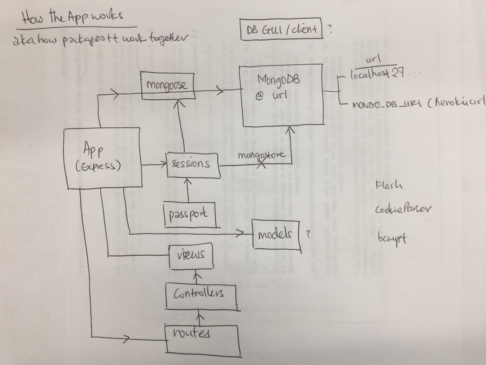
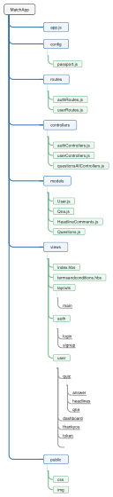

<!---
Read Me Contents
-->

#  Project #2
# **MatchApp**
#### because swiping right is not enough

**[View It Here](https://intense-cliffs-78971.herokuapp.com)**

---
### Overview

Dating apps today help us find matches based on looks and profile information. After swiping right, how do you know if you are truly suitable for each other?

MatchApp takes away the awkwardness of asking deeply personal questions on values and relationship expectations. Save time... and heartbreak!

---
## Planning

* **Entity Relationship Diagram (initial)**

  

* **Flow Diagram**

  

---
## Development

#### News API

 

#### Concept Diagram
How the app works
(aka: how _packages_ and other concepts work together e.g. _MVC, deployment, database client_)

#### Wireframes
https://drive.google.com/open?id=0B0RuV0ofDtIfZzYxRkVRRTVvOWc

#### Pseudo Code
https://drive.google.com/open?id=0B0RuV0ofDtIfTGlPQnp4RVMzeWs

#### Folder Architecture

---
## Main concepts and packages

#### Express
Express is a web application framework for Node.js
* Express is used to set up the web app
* __Package: express__

#### MongoDB and Mongoose
* MongoDB, the NoSQL database program, is used.
* The Object Data Modeling (ODM) tool, Mongoose, is used to connect the app to the database.
* Robo 3T (previously Robomongo) is used as the database client to help manage the MongoDB.
* __Packages: express, mongoose__

#### Session
The app employs persistent sessions.
* connect-mongo (MongoStore) is used to connect session data to the database
* __Packages: session, connect-mongo__

#### Authentication
The app uses passport (attached to sessions) for authentication.
A local passport strategy to provide signup and login authentication.
* Sign Up fails if: email address is taken, password is < 8 characters (works in combination with Model validators)
* Log In fails if: user is not found, password is wrong
* A pre save hook encrypts password data using brcypt before being saved into the database (configured in User.js model file)
* Authentication (log in) barrier imposed when user attempts to access any route beginning in /user (e.g. /user/dashboard, /user/results)
* If user's session is open (is authenticated) but navigates to /login or /signup, user is redirected to /user/dashboard
* __Packages: passport, passport-local, bcrypt__
* Based on [this repo](https://github.com/primaulia/passport-ref)

#### MVC Concept: Models, Views, Controllers... + Routes
* Routes direct requests to Controllers, which interact with Models (search and create documents), and generate Views
* View engine used is handlebars
* __Packages: handlebars__

#### Others
* body-parser: to parse requests. Works with express
* cookie-parser: to parse cookies. Works with sessions
* xmlhttprequest: to call API(s). This is a built-in node module
* flash: to flash info or error messages
* dotenv: to enable access to a .env file where sensitive data can be accessed privately by the app (e.g. API_KEY, MONGODB_URI), via "process.env."

#### Deployment
* The app is deployed and hosted on a heroku server

---
## Known Issues and Areas for Improvement

#### Fatal
_None_

#### Non-Critical
1. Flash messages not working reliably (e.g. sometimes multiple flash messages appear, sometimes flash messages do not appear)
2. User document
  - Name and token information not saved to database. Referral information not utilized
  - Populate qna and headlinecomments document ids
  - Populate timing data (created, last updated)

#### Good to Have  
1. Full CRUD functionality: ability to Update or Delete previous responses (now, only Create and Read)
2. Improve DRY: add something like app.locals = {user: req.user}, to avoid inserting into every res.render
3. Refactor routes and controllers to be more consistent (res.render and res.redirect occur on both routes and controllers)

---
## Project Development

1. Provide personality data based on user answers and comments. Use IBM Watson Personality Insights API
2. Include ranking questions and compare between linked users
3. Suggestions for how to use the results
4. Email or download results (currently only res.send to page)

---
## Built With

* [Heroku](https://dashboard.heroku.com/) - Deployment
* [Newsapi](https://newsapi.org) - API
* [Bulma](https://bulma.io) - CSS Module
* [NodeJS](https://nodejs.org) - Backend
* [MongoDB](https://www.mongodb.com) - Database
* CSS
* HTML5

__Contact: michelle.y.lai |at| gmail.com__
